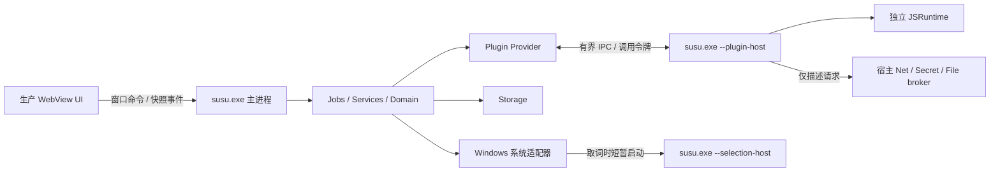
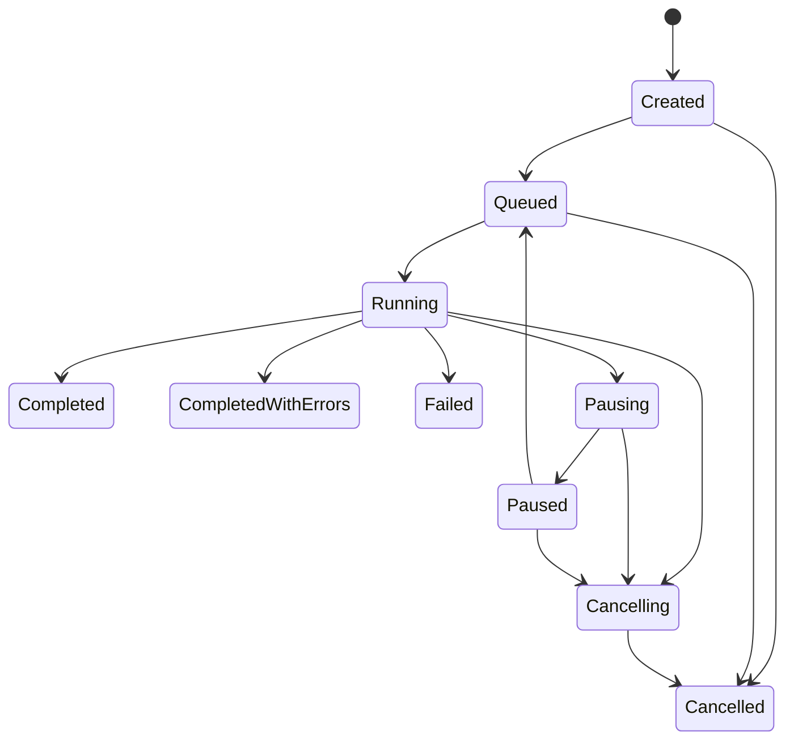

# Su-Su · 技术架构设计

> 上级：[架构](README.md) · 根目录：[README](../../README.md)

版本 A1，2026-09-19，设计基线。实施进度与验收结果见 [PROGRESS](../evidence/PROGRESS.md)，本文不记录状态。面向 PLAN 第四版、D-58 和线上第 17 版的 43 张画板；本次新增实现决策记录为 D-59–D-65。

文档分工：[`PLAN.md`](../product/PLAN.md) 定产品范围与插件公开契约；[`DESIGN.md`](../design/DESIGN.md) 定视觉/交互；本文定模块、接口、状态与数据实现；[`DEV-PLAN.md`](../development/DEV-PLAN.md) 定模块开发顺序和完成条件；[`TEST-PLAN.md`](../development/TEST-PLAN.md) 定验收场景。协议数值继承 PLAN，不在实现中另设一套。本文写的是目标结构；与已实现代码不一致时，以代码和模块交付记录为准，并回头修订本文。

## 1. 技术基线与验证门槛

| 层 | 决定 | 验证门槛 |
|---|---|---|
| 目标 | 首个发布目标 Windows 11 x64；ARM64 原生包后续另验收，不能由 x64 构建成功推导支持 | F00 锁定至少一台基准机，F19 覆盖当前受支持 Windows 11 build |
| 宿主 | .NET 10 LTS / C#，裸 Win32 + NativeAOT；手工组合根，无反射式服务扫描 | Release/AOT 在未装 .NET SDK/runtime 的干净系统运行 |
| 系统互操作 | Win32 使用源生成 P/Invoke；COM 以 GeneratedComInterface/GeneratedComClass 或显式 vtable 薄封装接入 | UIA、WebView2、SAPI、WASAPI、MF 各有真实 AOT 探针；IAccessible 的 IDispatch/VARIANT 不能假定源生成器自动支持 |
| 插件 | QuickJS-NG 固定版本的 C 库 + 薄 C ABI 包装；Jint 与 WebView 插件宿主保留 M0 对照 | ES module、Promise、取消、内存上限、异常和回调生命周期通过；最终引擎取 M0 数据 |
| UI | Vue 3 + TypeScript + Vite，SFC 预编译；不引入通用组件库/运行时模板编译器，不运行 Node 服务 | 复刻组件/token/资源表；生产静态资源在 WebView2 原生壳内通过；原型 HTML 仅作设计来源 |
| 配置/协议 | YAML 受限子集；JSON DTO 用 System.Text.Json 源生成；插件 config 用受限 JsonElement 树 | YamlDotNet 静态模式/低层节点解析在 AOT 发布中验证，不使用任意类型反序列化 |
| 存储 | Microsoft.Data.Sqlite + 随包原生 SQLite；显式 SQL/迁移，不引 ORM | AOT、WAL、备份恢复、安装包原生依赖通过 |
| 发布 | NSIS per-user；Ed25519 签清单，AES-GCM/DPAPI 按 PLAN；签名库固定版本并过已知向量 | F00 验证加密库 AOT/体积；私钥不进仓库/客户端 |

使用 .NET 10 LTS 是当前实现基线；具体 SDK、NuGet、npm、Windows SDK、QuickJS commit 在 F00 写入 global.json、集中包版本、锁文件和 native 依赖清单，此前不虚构已验证的补丁版本。开发 CI 可安装 Node/.NET，用户安装包不含它们。[.NET 支持策略](https://dotnet.microsoft.com/en-us/platform/support/policy)、[NativeAOT 限制](https://learn.microsoft.com/en-us/dotnet/core/deploying/native-aot/)

COM 不能使用依赖动态 stub 的传统 RCW 路线；SAPI 优先使用 ISpVoice 等 IUnknown 接口，IA2 的双接口继承用手写 vtable/ABI 薄层，不强套不支持的属性。[COM 源生成边界](https://learn.microsoft.com/en-us/dotnet/standard/native-interop/comwrappers-source-generation)

## 2. 进程、项目与依赖方向



主进程、插件进程共用同一 AOT EXE；新增取词助手是临时系统能力执行器，不是第三类 Provider，也不是每插件进程。助手不加载插件、不创建 WebView、不持有密钥/HTTP 栈；仅执行 UIA/IA2/剪贴板快照的只读获取，正常完成或超时即退出，不进入托盘闲置态。三个模式在 Main 最开始分流，禁止静态初始化顺带启动其他模式服务。

| 项目/目标目录 | 职责与公开入口 | 允许依赖 |
|---|---|---|
| Susu.Contracts | IPC/UI DTO、错误枚举、协议版本；类型有界且可序列化 | BCL |
| Susu.Domain | 服务身份、语言、任务状态、重试策略、窗口策略、分片与 ID 映射；纯逻辑 | Contracts |
| Susu.Abstractions | 系统/存储/网络/provider 端口，CancellationToken 与 DTO | Domain、Contracts |
| Susu.Jobs | 各功能用例和后台调度，组合端口，不写 Win32/SQL/HTTP | Abstractions、Domain |
| Susu.Storage | 配置事务、SQL 仓储、租约索引、导入导出；DPAPI 经 ISecretProtector | Abstractions、Contracts |
| Susu.Net | HttpClient 池、代理、origin/凭据授权、签名、二进制变换、SSE 文本传输 | Abstractions、Contracts |
| Susu.Plugins | 包注册/校验/激活、IPC 主端、PluginProvider、授权令牌 | Abstractions、Contracts、Domain |
| Susu.Runtime | JS 引擎、调度、宿主 API 的 IPC 代理、生命周期 | Contracts、引擎薄绑定；不引用 Net/Storage |
| Susu.Windows | 全部 Win32/COM、窗口/WebView/tray、UIA/IA2、录音/解码/截图、进程/管道 ACL、DPAPI | Abstractions、Contracts；原生库 |
| Susu.Windows.Selection | 取词助手（`susu.exe --selection-host`）的 UIA/IA2 读取与父端 SelectionReader；从 Susu.Windows 拆出，以引用关系证明助手不接触账户与网络（F08.1） | 仅 Abstractions；原生 `susu_selection.dll` |
| Susu.Ui | UI 命令白名单、会话投影、事件序列、窗口保温协调 | Jobs、Abstractions；不直接操作 COM |
| Susu.Host | 三种启动模式的组合根、退出协调、更新启动；业务外观很薄 | 上述项目；唯一负责装配具体实现 |
| ui/ | 窗口根组件、卡片/设置控件、zh-Hans/en 文案、token、typed bridge | 构建时协议类型；无 Node/HTTP/文件能力 |

修正 PLAN 原模块示意中“Host 自己写 Win32”与“平台实现唯一项目”的歧义：Host 只装配，消息泵等实际代码归 Windows。原生 QuickJS 是跨平台绑定，不视为 Windows API 实现。

建议目录：

```text
src/Susu.{Host,Contracts,Domain,Abstractions,Windows,Storage,Net,Plugins,Runtime,Jobs,Ui}/
ui/src/{bridge,components,windows,settings,locales,styles}/
native/quickjs-bridge/                源码构建，不接收第三方预编译 JS bytecode
plugins/{mymemory,deepl,...}/         每服务一个包，见 DEV-PLAN 的 21 项清单
protocol/{ipc,ui,plugin,manifest}/     schema + 兼容样例
tools/{contracts,susu-plugin,verify}/
tests/{Unit,Contract,WindowsIntegration,Ui}/
fixtures/{text,media,plugin,network}/  小型、可合法提交、无凭据的样本
docs/evidence/<模块ID>/               实测/完成记录；大媒体只存哈希和获取方法
```

协议先在 Contracts 与 plugin schema 中定义；构建工具产生 TypeScript DTO/d.ts 并做快照一致性检查，禁止两端手写同名不同形协议。默认不生成业务逻辑。功能模块只包含该功能的 Job、端口适配和 UI 根，引用公共组件，不复制翻译/鉴权管线。

## 3. 身份与服务注册

| 身份 | 关键字段 | 生命周期/存储 |
|---|---|---|
| PluginPackage | packageId、version、apiVersion、签名身份、安装实例、hash | 安装目录 + plugin_installations；内置 21 包与第三方同路径 |
| CredentialAccount | accountId、label、secretRefs；明文仅进入 SecretStore | 非敏感字段 settings，密文 secrets.dat |
| ProviderInstance | instanceId、packageId 或 nativeId、config、accountBindings、revision | settings；首版内置每包一个实例，第三方可后续扩展多实例，当前 UI 不承诺添加副本 |
| ServiceBinding | serviceId、instanceId、capability、enabled、orderKey | settings；一实例可有多个能力，独立启用/排序 |
| Invocation | requestId、jobId、generation、instanceRevision、capability、grantId | 内存；调用结束撤销 grant，绝不导入/持久化令牌 |

原生 SAPI/ELS 走相同 ServiceDescriptor，但无插件目录/账户；只有 PluginProvider 和 NativeProvider 两种生产实现。测试 fake 属测试程序集，不注册为第三种生产 Provider。

RuntimeRegistry 以 **packageId** 管理一份运行时；该包有任一启用能力时加载，最后一个禁用才销毁。配置按调用快照传入，不置于 JS 全局。禁用某能力只取消对应调用；若不得不重建运行时，对受影响的全部调用报错，其他包保留。验证未启用服务时可创建一次临时运行时，验证后无启用能力即销毁。

翻译引擎与 AI 页是同一 `translationOrder` 的过滤视图。页内拖拽只重排该页占用的原位置，另一页条目的相对位置不变；生产设置的“翻译结果”组可用一个合并排序列表调整跨类别位置，复用现有服务行（见 DESIGN 实现补充）。默认展开数只在这里取值。

可用性拆为 `Disabled / MissingCredential / UnsupportedCapability / Ready / TemporarilyUnavailable`；验证状态另存“未验证/成功时间/失败原因”，填了 key 不冒充验证成功。功能入口按依赖的 capability 解析，而不是检查某页的总开关。

### 3.1 动态选项和配置快照

新增插件可选函数 `options(req, ctx)`：请求 `{ field, dependsOnRevision, cursor? }`，返回 `{ items: [{ value, label }], nextCursor? }`。manifest 的 `x-susu.optionsSource: { dependsOn: [...] }` 仅允许绑定本实例已声明的字段；宿主校验依赖、输出类型、单页最多 200 项、单次 10 s，可取消。用于模型/牌组/生词本；TTS 音色继续用 voices。禁止返回 HTML、JS、任意动作；静态 enum 与远端列表取约定的同类标量值。

选项请求只有该 provider 的网络授权；普通模型/牌组读取不应产生付费生成请求。缓存 5 分钟，按实例 revision 和依赖值隔离；凭据/地址变化立即失效。验证按钮可产生测试请求，界面如实说明。旧响应不覆盖新配置。

每个任务固定 `SettingsRevision + ProviderRevision + PromptRevision`，用户保存设置只影响之后的调用。参数来源：用户显式服务配置 > manifest 默认值；AI 页面共享超时为“未设置服务覆盖值”时的默认；调用总时限受宿主 600 s 上限。temperature 等模型参数只在插件 schema 中；不支持的字段发送前拒绝。PromptProfile 用 ID/变量表替换，原文作为独立数据片插入一次，禁止递归替换原文里的变量；对传统翻译引擎不发送提示语。

## 4. 线程、阻塞隔离与运行时

| 执行域 | 所有者 | 约束 |
|---|---|---|
| 主 STA 消息线程 | WindowsDispatcher | HWND、WebView controller、托盘/热键和必要剪贴板写入；不能同步等待网络/SQL/外部 COM |
| Job 协调器 | 每 Job 一个串行邮箱 | 只有邮箱修改该 Job 状态；I/O 完成投递事件，避免跨线程直接写 UI 状态 |
| DB 写队列 | StorageWriter | 短事务单写；读连接使用快照；不能持事务等待网络 |
| HTTP/文件 I/O | 有界异步池 | CancellationToken、响应大小、lease 和背压；无闲置轮询 |
| WASAPI/MF | 独立采集/解码工作线程 | 回调只搬运有界缓冲；重采样、编码、文件操作不在消息线程 |
| UIA/IA2/物化快照 | 临时 selection-host | 独立 MTA 执行 UIA；需 OLE 的快照单独 STA；超时由父进程终止助手，不终止主进程线程 |
| JS | 插件进程两条固定调度线程 | 每 runtime 创建后固定一条线程，全部访问串行；网络等待是 Promise，不占线程 |

QuickJS 同一 runtime 不允许多线程访问，中断处理器用于终止执行，不能当作可恢复的时间片暂停。[QuickJS-NG API](https://quickjs-ng.github.io/quickjs/developer-guide/intro/)

同 runtime 最多 2 个在途能力调用；仅 JS 片段串行，挂起的网络可以并发。原生回调捕获宿主授予的调用令牌而非插件输入的 ID。单次连续 JS 执行预算初始 100 ms，M0 以最大合法 JSON 样本校准（必须形成记录，不能静默放大至无限）；超预算抛错并重建该 runtime，同时失败其所有在途调用。宿主 JS 回调不做阻塞 I/O。引擎不响应中断时，由主进程检测超出调用截止时间/活动期心跳，杀插件子进程。

同一 runtime 的无穷 microtask 链亦受连续执行预算约束，不能每个 microtask 重置；非忙状态不发高频心跳。进程崩溃自动重启退避 1/2/4 s，60 s 内三次失败则停止自动重启，设置中显示“重启插件服务”动作。已发送任务不自动重放，避免再次计费/写入。

### 4.1 取词助手

热键时捕获前台 HWND、PID、焦点与触发序号，然后可以显示**不激活的**正在取词壳；完成/取消前不抢焦点。助手总截止 500 ms（含启动），UIA 查询预算最多 300 ms，剩余预算允许 IA2；API 自带 timeout 只是辅助手段，父进程期限才是硬上限。超时后直接进入已允许的复制回落/失败，不无限重启。UIA 的 MTA 要求及超时属性按官方文档实现。[UIA 线程](https://learn.microsoft.com/en-us/windows/win32/winauto/uiauto-threading)、[TransactionTimeout](https://learn.microsoft.com/en-us/windows/win32/api/uiautomationclient/nf-uiautomationclient-iuiautomation2-get_transactiontimeout)

同一时刻只有一个取词流程；新热键使旧 generation 失效并取消助手。安全快照另给 200 ms，模拟复制等待 300 ms，不能把整个流程宣传为 300 ms。助手返回纯文本、来源与选区矩形，不泄露 COM 指针；传输快照使用受控共享缓冲/只读句柄并按 16 MiB 限制校验，不挤进插件 IPC。真正 SendInput 和条件恢复在主进程，仍遵守 PLAN 3.1 的输入活动/owner/序列号检查。

缓存失败目标的 PID+启动时间+控件框架 60 s；密码字段不取词/复制，多选区按屏幕阅读顺序合并并显式保留分隔，空选区不取插入符所在整段。进程退出清缓存。取词助手是同用户完整性级别的系统工具，不能被插件启动，不赋予提权权限。

## 5. 任务状态、重试与资源所有权



`Pausing/Paused` 只用于支持暂停的流水线；结束时有部分结果则进入 `CompletedWithErrors`（同样是终态）。任务拥有输入/输出 lease、子请求和取消源；WindowSession 只订阅投影。终态只能提交一次，取消不显示为“服务失败”。

视频另有 Decode/Asr/Translate 阶段状态；额度耗尽只暂停 Translate 的新投递，ASR 可继续且保留原文。用户点击整体暂停才让各阶段一起收束；切翻译服务产生新的阶段 operation，保持 segmentId 与已识别结果不变。

标识层次：`windowSessionId → jobId + generation → operationId → attemptId/requestId`。流块带 attemptId 与严格递增 sequence。新原文/重译增加 generation；宿主先检查 generation、实例 revision、attemptId，再更新投影；UI 再检查 session/序号。窗体重建使用完整快照，不依赖接收过全部旧事件。

卡片状态：`CollapsedIdle / Queued / Loading / Streaming / Ready / Failed / Cancelled / Unsupported`，折叠是独立显示标记。首次展开才建请求；折叠取消未完成调用，已成功结果在当前 generation 内保留，重展开复用；部分流结果清为未完成，重展开重新发起，不续接未知上下文。同 provider 有 dictionary 且符合单词规则时只查询词典；合法空词典结果才回落 translate，一张卡片不在折叠时偷偷查词典。

### 5.1 调度与重试

| 范围 | 默认限制/规则 |
|---|---|
| 全应用能力调用 | 8 个，排队最多 128；溢出显示忙，不丢弃无提示 |
| 单 provider 实例 | 2 个；账户+origin 共用限制器，避免不同插件绕过同账户限速 |
| 视频 | ASR 1 片、翻译最多 2 批；可继续解码最多预取 2 片，队列满就暂停解码 |
| 宿主 HTTP 子操作 | 继承 PLAN 每调用 4、进程总计 32；所有限制取最严格交集 |
| 交互优先级 | 新取词/翻译优于视频后台批次；每 5 次交互投递至少允许 1 次已等候后台批次，避免饿死 |

只有 JobCoordinator 决定自动重试，HTTP 层和插件不得各自再重试一遍。network/timeout 最多一次，退避 500 ms 加有界抖动；429 解析秒数或 HTTP 日期，Retry-After 大于 60 s 时停止自动等待并提示稍后重试。两个 attempt 共用总 deadline，超时默认按 PLAN；没有剩余预算就直接终态。用户手动重试是新 operation，但先清旧流结果。

已收到流式文本又失败：只读生成任务允许一次重新生成，先发 `ResultReset(newAttemptId)`，不能拼接两个 attempt；可能再次计费，usage 按实际 attempt 记录。auth/quota/unsupported/bad_response 不自动网络重试；字幕结构错配按 PLAN 仅降级逐条一次，不和网络重试形成乘法循环。

vocab 写入例外：请求已经送出但结果未知时进入持久化 `Uncertain`，先查远端/幂等键确认，不能通用重试。取消不能保证撤销供应商已收到的请求，计费结果和未确定写入状态要保留。

### 5.2 窗口动作

| 动作 | 普通翻译/OCR/录音 | 视频转写/后台收藏 |
|---|---|---|
| 最小化到托盘 | 继续既有处理；录音保留明确托盘录制状态 | 继续 |
| Esc/关闭窗口 | 取消当前任务和录音，释放采集；保留已完成投影直到窗口会话重置 | 取消视频并保留本次进程内已识别结果供重开导出；收藏 outbox 独立于窗口继续 |
| 点击暂停 | 录音暂停不上传，10 分钟按实际采集时长计 | 视频停止新批次/预取；在途完成后 Paused，恢复用同 jobId |
| 退出应用 | 统一取消、等待有界清理、撤销租约、杀子进程 | 不做视频跨启动续转；收藏队列持久化，未确定写入保持 Uncertain |

隐藏的 WebView 不是任务拥有者；释放 WebView 不取消合法后台工作。退出清理最多 3 s，恢复/导出等已经在原子提交点后的写入由启动恢复协议接管，不无限卡退出。

## 6. IPC 与 UI 协议

插件 IPC 使用 32-bit 小端长度 + UTF-8 JSON（PLAN 的帧/分片上限不变）。握手声明 protocolVersion、hostBuild、processRole、启动身份；不兼容立即拒绝。消息类型仅 `Invoke / ApiCall / ApiResult / Chunk / Ack / Cancel / Completed / Failed / RuntimeFault`；unknown type 不执行。请求 ID 不可重用，完成后的 late result 丢弃并只计诊断数。

所有业务消息至少包含 `{ protocolVersion, type, requestId, jobId, generation, sequence, payload }`，ApiCall 另带 grant。control 优先队列不受正文背压堵塞；每调用未确认流缓冲最多 256 KiB，全进程最多 4 MiB，接收方消费后 Ack，超过窗口停止读取网络；取消可立即穿过控制队列。设置/日志不共用可无限增长的流队列。

UI 消息采用另一套 `uiVersion`，不把 grant/secret/真实文件路径交页面：

| 命令族 | 例子 | 服务 |
|---|---|---|
| Translation | SubmitText / ToggleCard / RetryCard / SelectLanguage | TranslationSession |
| Capture/Audio | BeginCapture / StartRecording / PauseRecording / StopRecording | 对应 Job |
| Transcription | PickMedia / Start / Pause / ChangeTranslator / Export | VideoJob；路径由宿主选择器换成 mediaToken |
| Settings | Read / Save(expectedRevision) / ValidateProvider / LoadOptions / BindAccount | 配置事务与服务目录 |
| Secret | WriteNew / Delete / ExportEncrypted / ImportEncrypted | 仅设置 origin + 当前设置会话 |
| Vocab/Window | Collect / ExportQueue / Speak / CopyText / Close / Pin | 各用例，参数白名单 |

首次页面 Ready 后宿主发送 snapshot(revision)，后续发 patch(sequence)；断序请求新快照。流式 UI 按最多 30 次/秒合并更新，终态立即提交。Vue store 只是投影和未提交表单，不持久化任务真相。设置保存使用 expectedRevision 冲突检查，不能盲目覆盖用户手改。

## 7. 功能模块的端口和流程

以下为宿主内部端口形状，具体 DTO 在对应模块实现前固化；公开 JS 契约按 PLAN 和本文 3.1/8.3 的必要补充。

| 端口/用例 | 输入 → 输出 | 宿主责任 |
|---|---|---|
| ITranslationService.Start | TextInput + settings snapshot → jobId + events | 检测/服务排序/卡片/分片/重试/usage |
| ITextSelection.ReadAsync | ForegroundSnapshot + deadline → SelectionResult(text, rect, reason) | 助手、焦点、超时；复制回落是独立显式步骤 |
| IClipboardService.ReadText | 当前剪贴板 → bounded text 或 reason | 热键时读取；监听只用于复制事务，不自动上传所有复制内容 |
| IScreenCapture.CaptureRegion | monitor snapshots + drag → image lease 或 cancel | DPI/物理像素、8×8 边界、遮罩去除、编码 |
| IAudioCapture.Start | microphone/loopback + device → capture session | PCM 写盘、电平、设备断开、静音/时长结束 |
| IMediaDecoder.Decode | mediaToken + accepted format → bounded audio chunks | MF、保留时间轴、多音轨默认首条可解码音轨、无音轨明确错误 |
| ITtsService.Speak | text + selected service + voice → playback session | SAPI/下载句柄、播放互斥、停止、缓存 |
| IVocabService.Collect | 用户确认的卡片内容 → local entryId | 先落本地，再出队同步；导出不依赖在线服务 |

输入翻译是所有录入功能的共同终点；OCR/录音 Job 只产生新的 TextInput，不复制卡片逻辑。普通输入先 Unicode 快判，混排走 ELS；外部检测服务不得隐式上传密码字段，检测失败回默认语言，不阻塞至翻译总 deadline 之外。非中英输入允许用户手动指定，不自动宣称检测准确。

TTS 一次仅有一个播放会话，新播放停止旧播放并释放旧 lease。本地 SAPI 不要求插件进程可用。词典真人音频只在当前词典结果已可用时优先，否则走默认 TTS，不为发音暗中展开折叠词典卡。

系统回环录音默认包含整个输出设备，播放 TTS 时不自动过滤 Su-Su 声音，界面录音状态提示该事实；设备切换/休眠时停止并保留已采集片段，用户决定转写/重录，不静默换到另一设备。以上异常状态复用已有状态行/次按钮。

## 8. 存储、迁移和故障恢复

### 8.1 目录与配置

```text
%APPDATA%/Su-Su/                settings.yaml、secrets.dat、用户 plugins/
%LOCALAPPDATA%/Su-Su/           susu.db、logs/、cache/、webview/、transactions/、updates/
%LOCALAPPDATA%/Programs/Su-Su/   安装文件、内置 plugins/
Pictures/Su-Su/                用户打开“保留截图”后的独立副本（可选目录）
```

LocalAppData 放运行态，避免漫游复制数据库/缓存；首版未发布，无旧版用户目录迁移负担，测试旧结构仍需迁移样例。DPAPI 绑定本用户，漫游 secrets 不等于换机可用。

settings 包括 schemaVersion、revision、语言/热键、providerInstances、serviceBindings、accounts 的非敏感描述、排序、promptProfiles、代理与窗口偏好。宿主生成稳定键序和注释。Save 读取预期 revision/文件 hash → 校验 → 同目录写临时文件并 flush → 原子替换及保留上一版。用户手改采用文件事件+300 ms 去抖；非法文件保留为待修复输入并继续使用最后有效配置，绝不用默认值覆盖；未知字段/重复键/禁用 YAML 特性报精确路径。

涉及 settings 与 secrets 两文件的事务：暂停相关新调用→在本用户受保护的 transactions 目录写两份新文件/旧备份与 journal→标记 Prepared 并 flush→逐一原子替换→写 Committed。程序启动先恢复 journal，未 Committed 回滚两份旧文件，已 Committed 完成清理；目录权限与 secrets 相同，备份仍为 DPAPI 密文。不能把两个独立 rename 宣称为跨文件原子操作。

导入仅包含非敏感设置和可选加密凭据，不含插件代码、日志、缓存、收藏 DB 和已授予的运行令牌。首版采用“替换设置”，导入前自动备份；完整校验/解密/版本检查后在重启时用上述事务提交。缺失插件配置保留但禁用；origin/账户绑定重新确认后才激活。错误密码/过大包/过高 KDF 参数不改变现有状态。PBKDF2 600k–2M，归档解压总量≤32 MiB、单项≤8 MiB，拒绝路径逃逸；导入文件不得自行安装插件或放宽授权。

### 8.2 数据库

单写队列，SQLite foreign_keys=ON、WAL、busy_timeout 有界；短事务提交，异常回滚。SQL 都用参数；schemaVersion 只向前迁移。迁移前用 SQLite 在线备份 API，不在 WAL 活跃时只复制主文件；失败恢复同版本备份。[SQLite backup API](https://www.sqlite.org/backup.html)

| 表 | 键/主要字段 | 约束 |
|---|---|---|
| meta | key PK, value | schemaVersion、安装数据版本 |
| window_state | windowKind PK, monitorHint, x/y/DPI | 只恢复位置；不记最大化/大小 |
| usage | provider/account/period/metric 复合键, count | 由 attempt 事件幂等聚合；非供应商余额 |
| usage_events | attemptId+metric UNIQUE, units, outcome, day | 不存正文；聚合后保留 7 天去重 |
| plugin_kv | installationId+namespace+key PK, valueJson, bytes | 实例/包命名空间由宿主定；每包默认≤1 MiB，总≤32 MiB |
| plugin_installations | installationId PK, packageId, version, signer, hash, active | 当前激活指针与旧版本恢复信息 |
| vocab_entries | entryId PK, lang, normalizedText, displayText, contentJson, revision, deletedAt | UNIQUE(lang, normalizedText)；NFC、英语大小写折叠，原文保留 |
| vocab_deliveries | entryId+targetInstanceId+entryRevision UNIQUE, operationId, state, remoteId, attempts, nextAt | 每目标独立状态，FK entries |
| vocab_exports | exportId PK, format, fileHash, createdAt, outcome | 原子文件成功后才标成功 |
| vocab_export_items | exportId+entryId+entryRevision PK | 支持重复导出记录，不把 API 已同步当已导出 |

`vocab_queue` 由 entries/deliveries/export_items 的查询投影提供，取代单表承担所有状态。没有翻译 history 表；用户明确收藏的卡片不属于自动历史。首版不做独立生词管理窗口；取消收藏是当前卡片的 toggle，本地标删除、停止尚未发送的同步，不默认远程删除已经加入的词。

### 8.3 收藏 outbox 与导出

本地收藏与创建每目标 outbox 在同一事务；消费者状态 `Pending → Sending → Succeeded / RetryWait / Uncertain / Failed`。重复点击相同 entryRevision/target 不产生新 operationId。

公开 `vocab` 请求补 `operationId`、`action: upsert|lookup`、entryRevision；结果为 `{ status: applied|found|absent|unknown, remoteId? }`。manifest 声明是否支持 lookup、远端幂等键。Anki 以稳定苏苏词条标识字段查询后添加/更新；不支持可靠查询的服务在响应丢失时标 Uncertain，提示到目标生词本核对，不自动重发。重启把 Sending 转 Uncertain，避免崩溃后重复提交。仅确定尚未发出的连接失败可重试；收到成功才写 remoteId/完成时间。

文件导出先冻结 entryRevision 集合，写同目录临时文件→flush→rename→事务记录成功。文件已成功而 DB 未提交时，通过 exportId/文件哈希恢复标记，不能自动再生成另一个副本。CSV 正确转义，`.apkg` 按固定测试版本的 Anki 实际导入验收，不假设 zip+任意 SQLite 就兼容。远端写入和本地导出互不影响。

### 8.4 保留策略

| 数据 | 默认策略 |
|---|---|
| 临时 OCR/音频/TTS | lease 到零删除；退出清理；启动清理上次会话遗留，活动 lease 永不删 |
| 当前视频临时片 | 预取最多 2 片，ASR 接受结果后释放；整体临时媒体预算 512 MiB，剩余空间不足时暂停并提示 |
| 保留截图副本 | 仅开关开启时写 Pictures/Su-Su，默认保留 7 天；只删带本应用索引的文件，不扫用户其他图片 |
| TTS 磁盘缓存 | 明确启用缓存时上限 32 MiB、7 天，key 包含文本 hash/服务/声音/速度/配置 revision，不含明文 key |
| 日志 | 7 天且总≤10 MiB，轮转；按 PLAN 脱敏和限流 |
| WebView UDF | 独立 LocalAppData/webview，禁止页面持久化业务/凭据；引擎缓存量单独计量，环境完全退出后才可清理 |
| 收藏/用户设置 | 用户主动删除或卸载选项决定，不因窗口关闭清除 |

## 9. 窗口、DPI 与生产 UI

设计尺寸统一为 96-DPI DIP（WebView zoom=1 时 CSS px），进程启用 Per-Monitor V2。坐标存物理虚拟屏幕点和采样 DPI/monitorHint；打开时按当前工作区验证并 clamp，跨 DPI 接收 WM_DPICHANGED 后重算布局，截图坐标始终以物理像素计，再归一化给 OCR。GDI/DXGI 具体截图后端由 F00 测试选定，不能用 CSS 截图替代系统采集。

主窗口/结果窗按设计默认尺寸打开，可最大化和恢复；首次不恢复最大化，首版不提供任意拖边改大小。设置窗居中、不记位置，同样可最大化；窗口适配到工作区以内，主体滚动、底部操作可达。悬浮窗最大高度为工作区 DIP 高度减 32（不足则用实际可用高度），内部列表滚动。记忆位置规则优先遵守 PLAN，但仅标题栏可见还需整体 clamp；内容不够放时缩窗而非把按钮挤屏外。

所有窗口复用 1 个 WebView environment，每窗口 1 个 controller；设置和结果采用不同可信 origin。close/minimize 后 IsVisible=false、取消订阅不需要的 UI 流量并清密码，保温不等于不停处理 DOM。最后一个可见窗隐藏后 10 分钟，关闭全部 controller，释放事件引用和 environment，等待 BrowserProcessExited；不能只把变量设 null 就算浏览器退出。若仍存活按诊断记录处理，不盲杀可能共享的 Edge 进程。[WebView2 进程模型](https://learn.microsoft.com/en-us/microsoft-edge/webview2/concepts/process-model)

Vue 只打包运行时，模板构建期编译，按窗口按需加载；所有色值来自 token，中文/英文文案从第一天抽资源。设计原型的 support.js/DCLogic 不进生产，icon SVG 转安全资源。[Vue 构建建议](https://vuejs.org/guide/scaling-up/tooling)、[性能建议](https://vuejs.org/guide/best-practices/performance)

快捷键编辑遇冲突用逻辑动作组处理：只允许划词+剪贴板共享，同一次按键先取词再读剪贴板；OCR/发音独立，不参与共享。划词热键唯一入口按 D-51 保留，托盘不提供可点击划词命令。所有快捷键须检查 RegisterHotKey 失败。Ctrl+Enter 提交翻译，Enter 输入换行且 IME composition 中不提交；Esc 优先关下拉/弹层，再取消截图或按窗口规则关闭。Tab 顺序、焦点边框、ARIA、屏幕阅读与英语长文案均纳入 F03/F19。

离线按 `(origin, proxyProfile, local/remote)` 记录，不按系统“有无 Internet”总开关禁止服务。一次服务失败不证明全网离线；只有当前所有远端路径都有可重试网络故障才显示统一提示，保留已有译文和本地 Ollama/SAPI/Anki 可用项；不强制折叠所有卡片。恢复由显式重试或下一次请求探测，闲置不轮询外网。

## 10. 插件安装、升级与应用更新

包导入：校验大小/结构→manifest/schema/API/minHost→文件列表/hash/签名身份→权限与凭据用途差异确认→暂存不可执行目录→事务切换激活版本→重启插件宿主→加载探针→成功提交或退回旧版本。最多 256 文件、解压≤16 MiB，拒绝路径穿越、绝对路径、设备名/ADS、符号/硬链接、重解析点、大小写重复路径和压缩炸弹。

第三方首版仍允许未签名安装；一旦用户信任签名身份，后续不能静默换 signer 或退化为未签名。hosts/credentialUse/update origin 增加时形成待确认更新，旧版继续工作；减少权限直接收紧。插件安装/更新中断在途任务，要在动作旁说明，不重启应用。加载失败不删除旧目录，恢复旧激活指针；KV 迁移只允许声明版本化命名空间，首版不执行任意主进程迁移脚本。

签名采用分离文件：应用清单 signature 对发布的 UTF-8 YAML 原始字节签名（不重新格式化后验签），先验签后解析；插件对域分隔的 manifest 原始字节与按规范路径排序的文件哈希列表签名。schema 拒绝未签名额外文件和重复键。根公钥离线；轮换由当前可信 key 签发新 keyId/公钥/用途与生效版本，新版本保留过渡 keyring，不能从未签名网络响应换根。

应用更新器在用户明确安装更新时运行：下载暂存/验签/验 hash→暂停新任务并提示在途任务影响→退出主进程→安装器等待退出后替换二进制→新应用迁移 DB→成功标记。安装器保存上一版二进制及迁移前 DB 备份，首次健康检查失败一起回退，不能旧二进制直接读新 schema。断电阶段由 journal 恢复。自动后台检查不自动安装；主动检查遇签名失败明确报错，不能显示最新版。NSIS updater 的工作目录/包路径必须校验，不能接受 WebView 任意 executable 参数。

应用/插件更新检查共用低优先级串行调度：启动完成 15 s 且距上次尝试至少 24 h 时检查一次，另支持手动检查与关闭自动检查；不在闲置持续轮询。下载/安装与检查分离。

卸载先关进程并删除容器 profile/程序文件；用户设置、收藏、保留截图默认保留，清除用户数据为明确选项。第三方许可清单、native 依赖和安装器许可随发布产物核对。

## 11. 性能与可观测性

目标仍为 PLAN 闲置≤25 MiB、保温≤60 MiB、CPU<0.1%；这是整树 PWS 的待验证目标，**不把渲染进程仅算一份**。M0 测全部拟用窗口，M5 用正式窗口复测；默认插件集合与全部 21 包启用分别测，不以空插件壳代表真实负载。记录 private bytes/commit 和峰值，PWS 小不等于没有内存压力。

时钟用单调计时；事件点 `HotkeyReceived / NativeShellVisible / UiReady / SelectionReady / FirstRequestDispatched / FirstResult`。冷态 ≤150 ms 指带明确等待反馈的原生壳可见，冷建首个可交互内容≤300 ms；热态窗口内容可见≤50 ms。系统取词可能更久，不能将空壳指标宣传为翻译完成。取词完成→首请求≤50 ms 以本地检测路径衡量；用户显式选远端检测时另外记录检测 RTT 与调度开销。

基准记录硬件/电源/缩放/build/runtime；每场景至少 30 次，报告 P50/P95/最大值，目标默认按 P95，异常点另解释。关闭全部窗口后第 5 分钟测保温，默认第 10 分钟释放后再静置 5 分钟测闲置；不在同一次采样混淆状态。测冷启动、全窗保温、100 次开关、最长录音/42 分钟视频后回落、取词助手残留以及第三方异常。

数据只本地输出，用户触发“导出诊断”时过滤正文/凭据/文件路径；不新增遥测。每个功能发布证据记录通过的测试 ID、失败/未执行项、实测环境和 commit，禁止在无真实凭据/无 Windows 的环境把集成验收标通过。

## 12. 实施边界

生产接口在相应模块开工时落实为源码与 schema，并在契约变更时先更新文档/样例/兼容测试，再修改消费者。未实现模块通过 FeatureRegistry 显示为开发中或不注册入口；发布构建不得把依赖未完成的功能标为可用。

“单独开发模块”指其只依赖明示的已完成公共能力，并能用可控 fixture 运行自己的 Job/UI，再接真实适配器验收；不代表每个功能打成独立 EXE，也不要求先实现所有 21 家服务。完整顺序、独立开发入口和验收标准见 DEV-PLAN。
