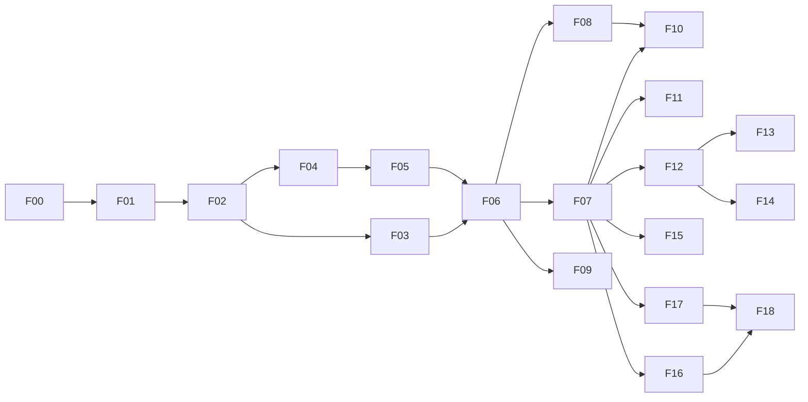

# Su-Su · 模块开发计划

> 上级：[docs/README](../README.md)  
> 子文档：[BUILD](BUILD.md) · [TEST-PLAN](TEST-PLAN.md) · [MODULE-TEMPLATE](MODULE-TEMPLATE.md) · [THIRD-PARTY-NOTICES](THIRD-PARTY-NOTICES.md) · [PROGRESS](../evidence/PROGRESS.md)

版本 D1 · 2026-09-19。依据 PLAN 第四版、ARCHITECTURE A1、DESIGN 与线上第 17 版的 43 张画板。当前只有方案与原型，**尚未开始应用开发，所有验收未执行**。

本计划按功能纵向交付：每个模块同时完成所需的 Job、系统/插件适配、设置、UI、错误处理和验收，交付可演示的功能。公共基础先做，功能模块按硬依赖选取；不用等所有服务插件完成才开始下一个功能。M0–M5 是质量关卡，F00–F19 才是可派发的工作单元。

## 1. 如何按模块推进

1. 从下表选择一个硬依赖已完成的模块，把状态改为“进行中”，使用 [模块交付模板](MODULE-TEMPLATE.md) 建立 `docs/evidence/Fxx/Fxx.md`。
2. 先列契约、涉及项目、最小演示和失败场景，再实现最小闭环。测试替身只在测试/开发构建使用，生产始终接真实端口；模块未实现时不注册可用入口。
3. 先通过离线契约和业务测试，再在 Windows 上验证系统能力、AOT 产物与真实服务；没有平台/凭据时标记“待集成验收”，不能记“完成”。不把收费账户的配置误当作所有后续开发的阻塞。
4. 完成出口用例、更新设计/契约差异和证据后，把模块记“完成”，再选择下一模块。若公共契约必须变更，先更新 schema、兼容样例及调用方，避免临时穿透模块边界。

状态为：待开始 → 进行中 → 待集成验收 → 完成；不能推进时记录“阻塞”及具体原因。下表只有 F00 可立即开始；其余依赖尚未实现。“可开始”不代表技术可行性已经验证。

| 模块 | 功能交付 | 硬依赖 | 当前状态 | 体量参考 |
|---|---|---|---|---|
| F00 | 工程骨架、工具链与 M0 可行性原型 | 无 | 完成（见 [F00 证据](../evidence/F00/F00.md)；PER03 热/冷可交互两项未达标，按 D-66 接受为已知差距） | L |
| F01 | 领域模型、协议、任务调度 | F00 / G0 通过 | 完成（见 [F01 证据](../evidence/F01/F01.md)） | M |
| F02 | 配置、账户、凭据与数据库基础 | F01 | 完成（见 [F02 证据](../evidence/F02/F02.md)） | M |
| F03 | Win32 壳、生产 UI、窗口与设置基础 | F02 | 完成（见 [F03 证据](../evidence/F03/F03.md)；多屏/混合 DPI、真实输入法、读屏、高对比度与生产壳 PER03 按 D-67 移到 F19 实机验收） | L |
| F04 | 插件运行时、IPC、沙箱与监护 | F02 | 完成（见 [F04 证据](../evidence/F04/F04.md)；流式分块限额待首个流式能力实测） | L |
| F05 | 网络代理、签名、文件句柄与契约探针 | F04 | 进行中（见 [F05 证据](../evidence/F05/F05.md)） | L |
| F06 | 输入翻译最小完整产品 | F03、F05 | 待开始 | L |
| F07 | 完整服务设置、提示语、动态选项 | F06 | 待开始 | M |
| F08 | 划词与剪贴板翻译 | F06 | 待开始 | L |
| F09 | 词典卡片与有道服务 | F06 | 待开始 | M |
| F10 | 发音、音色与播放 | F07、F08 | 待开始 | M |
| F11 | 截图 OCR 与识别翻译 | F07 | 待开始 | L |
| F12 | ASR 公共管线与麦克风语音翻译 | F07 | 待开始 | L |
| F13 | 系统音频录制翻译 | F12 | 待开始 | M |
| F14 | 视频转写、字幕翻译与导出 | F12 | 待开始 | L |
| F15 | 生词收藏、文件导出与 API 同步 | F07 | 待开始 | L |
| F16 | 插件安装、更新、卸载与开发者工具 | F07 | 待开始 | L |
| F17 | 设置备份恢复、诊断与关于 | F07 | 待开始 | M |
| F18 | 安装器、应用更新与回滚 | F16、F17 | 待开始 | L |
| F19 | 全功能集成、发布验收 | F08–F18、全部 P 项 | 待开始 | L |

S/M/L 只表示相对工作量，不是日历承诺；一个 L 模块按下文子任务分多次提交。人员数量、测试硬件与供应商账户尚未给定，因此不编造完成日期。默认一人顺序推进 F00→F19；完成 F07 后也可以优先选择 OCR、录音或收藏，彼此不依赖。F14 不依赖 F13，F15 不依赖 F09，F16/F17 不依赖媒体功能。F04 与 F03 可在同一公共基线后分别推进。

图中省略 F19 的汇合连线，依赖以上表为准。F09 的词典音频增强在 F09/F10 都完成后接入；不阻塞独立 TTS。跨模块增强仍需在 F19 验收，不可永久留成 TODO。

## 2. 质量关卡与最早可用版本

| 关卡 | 对应原里程碑 | 必须完成的证据 | 失败时 |
|---|---|---|---|
| G0 | M0 | F00：NativeAOT/COM/QuickJS、沙箱访问矩阵、取词三级原型、全窗保温与延迟；引擎三路线同口径比较 | 停止依赖该路线的产品实现；按 PLAN 2.4 调整路线、预算并记录决策，不能悄悄提高目标 |
| G1 | M1 | F01–F06：4 个基础插件、可运行输入翻译、所有能力契约探针；B/S/X/T 与基本 A 用例；冻结 API v1 | 修正契约后重跑受影响消费者，不推迟到媒体功能才验证二进制接口 |
| G2 | M2 | F07–F10：设置、取词、词典、发音完整流程；目标程序覆盖、键盘、DPI | 保留已验收输入翻译；不把未通过取词方式对外标成可用 |
| G3 | M3 | F11–F13：OCR、麦克风、回环，设备异常和最大录制时长 | 明确不可用状态，不用假结果填充生产 UI |
| G4 | M4 | F14：42 分钟视频、额度恢复、SRT/VTT/TXT、解码与时间码精度矩阵 | 只声明实测通过的容器/编码/模型组合 |
| G5 | M5 | F15–F19 + 全部 21 插件；安装/更新/恢复、性能、许可及发布检查 | 不能用契约 fixture 代替真实服务/Windows 发布验收 |

**第一个可日常试用的版本在 F06 / G1**：托盘启动→输入文本→MyMemory/已配置服务结果→取消/重试→保存设置→退出重开。此前 F00 是可行性原型，不是产品版本。G1 的 OCR/ASR/TTS/vocab 探针只验证契约，不要求提前完成对应功能 UI。

## 3. 公共基础任务

### F00 · 工程骨架与高风险原型

输入：ARCHITECTURE 1/2/4/9/11，PLAN M0，43 张画板。

- [x] F00.1 建 `src/`、`ui/`、`native/`、`protocol/`、`tests/`、`tools/`，锁定 .NET SDK、NuGet、Node LTS、pnpm/Vue/TS/Vite、原生工具链和 QuickJS-NG commit；提交 lockfile、构建说明、许可清单。基线 `win-x64`，Windows CI 必须 publish NativeAOT，不以 Debug/JIT 编译替代。
- [x] F00.2 最小 HWND/WebView2、UIA/MTA、IA2 手写 COM 边界、SAPI ISpVoice、WASAPI/MF 初始化、ELS、DPAPI、SQLite、YAML、Ed25519 向量分别打通 AOT 探针；未用到的 WinRT 绑定不为了“架构完整”提前引入。
- [x] F00.3 实现可丢弃的 AppContainer/IPC/JSRuntime 探针；QuickJS-NG、Jint、WebView 插件备选三条路线测加载、取消、往返、内存；确定引擎后把已验证薄绑定迁入产品。
- [x] F00.4 临时取词助手、无激活等待壳、UIA→IA2→可选借用剪贴板；10 个程序含 Firefox 和旧 Electron；阻塞/焦点变化/格式恢复/超时/助手回收。
- [x] F00.5 用拟用全部窗口的代表页面测暖态、冷态、保温释放；选择系统截图后端并验多屏坐标。记录硬件与失败指标，不只测一个空白 WebView。

交付：可重复运行的探针、锁定依赖、Windows 构建任务、路线决策和 `docs/evidence/F00/`。出口：C01–C07、X01–X07 原型访问矩阵、PER01–PER05、SEL01–SEL03；生产端完整授权在 F04/F05 再验。无 Windows 环境时仅可完成源码/离线部分，G0 保持未通过。

### F01 · 协议、领域与任务框架

- [x] F01.1 定义 Contracts/Domain/Abstractions，生成 TS DTO 与 plugin d.ts；版本协商、API schema、未知消息拒绝、兼容样例。
- [x] F01.2 实现 package/account/instance/service/invocation 身份与能力解析；配置快照、语言码、限制单位、Unicode 分片和字幕 ID 纯逻辑。
- [x] F01.3 Job 串行状态归约、generation/attempt/seq、取消/暂停、全局与服务限额、公平队列、retry deadline；定义 UiSnapshot 投影，不引用窗口实例。
- [x] F01.4 注册功能模块与测试 fixture，建立确定性时钟/失败网络替身；不实现具体供应商与系统能力。

交付：可离线运行的任务/协议测试与 typed contracts。出口：J01–J06、T01/T03–T05 的纯逻辑部分；旧片、重试重复、无限排队均被测试覆盖。

### F02 · 配置、凭据与数据基础

- [x] F02.1 实现 settings schema、默认服务绑定、revision/hash、文件事件、非法配置保留、原子保存、版本迁移与两文件 journal 恢复。
- [x] F02.2 SecretStore/DPAPI、账户用途和 origin 授权、密钥写入/替换/删除；代理密码同一条安全路径。
- [x] F02.3 SQLite 单写队列、WAL/外键、迁移/备份、window_state/usage/plugin_kv；为收藏保留迁移入口，具体收藏表在 F15 落地。
- [x] F02.4 文件租约索引、清理基础、脱敏结构日志；测试配置目录可隔离，开发不写真实用户配置。

交付：可调用的配置/账户/数据端口和恢复工具。出口：DATA01–DATA04、S01/S02 的授权模型测试；中途断电/手改冲突不会静默覆盖有效数据。完整导入导出留 F17。

### F03 · 原生壳与生产 UI

- [x] F03.1 三种启动模式、单实例、托盘、热键注册、WebView2 缺失提示/官方安装入口；Win32 代码全部进 Windows 项目。
- [x] F03.2 Vue SFC/token/中文英文资源、卡片和设置控件、typed bridge、可信 origin/CSP/导航限制、消息白名单、snapshot+patch。原型 HTML 不作生产页面加载。
- [x] F03.3 窗口位置/DIP/DPI/最大化/工作区、无激活等待壳、保温/释放、关闭与最小化不同任务语义、键盘/IME/焦点。
- [x] F03.4 最小通用/热键/服务账户/代理与超时设置、凭据单向写入；开发预览用 fixture 演示加载/成功/错误/不可用态，未实现功能不注册正式入口。F07 再扩展完整动态服务配置。

交付：能启动、设置并正常退出的原生壳和 UI 组件库。出口：UI01–UI06、S07/S08、PER02/PER04；无后端成功状态伪装。最终全部画板视觉比对在各功能与 F19 完成。

### F04 · 插件运行时和 IPC

- [x] F04.1 复用 F00 验证路线实现 profile/ACL/Job/管道身份、只读插件资源，禁止沙箱失败回落；基础包 schema/安全路径/签名读取先完成。
- [x] F04.2 模块加载器、受限 Web API、每包 runtime、两条固定线程、异步任务和中断；禁用能力、死循环、微任务饥饿与多调用影响传播。
- [x] F04.3 有界帧/流窗口/ACK、控制消息优先、API 调用令牌、主子进程版本协商、退出与重启退避；异常结果分类。
- [x] F04.4 注册内置 manifest/两种 Provider，实现最小 `susu-plugin check/test` 的真实运行时通道，供 F05/F06 契约探针使用；完整 init/作者文档和用户安装界面留 F16。

交付：真实沙箱中的测试插件可调用宿主代理替身，异常插件可回收。出口：X01–X07、S09、J04/J06/J07；测试替身不带进生产组合根。

### F05 · 网络与插件契约可执行证明

- [ ] F05.1 HttpClient/代理/超时/取消/SSE/WS、origin/DNS/重定向验证、显式凭据注入、最终 body 签名；调用者不能选择任意本地文件。
- [ ] F05.2 FileHandle/lease、流式上传、multipart、JSON Base64 插入与提取、响应错误分类、字节限额及资源清理。
- [ ] F05.3 实现 TC3/AWS/有道等 PLAN 签名器的官方测试向量/固定请求样例；不把完整凭据回给插件。
- [ ] F05.4 用真实插件宿主跑 OCR JSON、ASR multipart/inlineData、TTS JSON/原始音频、翻译 batch、options、vocab lookup/upsert 的契约探针；开发最小适配器供后续对应模块复用，不复制临时协议。

交付：可用于全部能力的 broker 和 API v1 候选。出口：B01–B08、S01–S06/S09/S10、A01–A04、T03–T05、DATA06 的契约部分；真实调用与回放分别记录。G1 必须在探针真实通过后冻结，无法提供账户的探针明确未执行。

## 4. 功能模块任务

### F06 · 输入翻译（第一个产品闭环）

- [ ] F06.1 TextInput→语言检测/方向→展开卡片→调用→结果/错误；原生 ELS、MyMemory 默认可用，长文本限制统一处理。
- [ ] F06.2 完成 P-T01/P-T02/P-T03/P-A01（MyMemory、腾讯、DeepL、OpenAI），密钥配置/关联/验证、流式 OpenAI、用量去重、折叠取消/重开/换语言。
- [ ] F06.3 Main/Card/Error 与必要 SetGeneral/SetEngines/SetAI；服务级网络状态、保留已有译文，复制结果、手动重试及默认展开数。

独立演示：全新配置启动→免 key 翻译→配置 OpenAI→流式结果→折叠并取消→重开正常请求。出口：T01/T02、J01–J06、UI03/UI04、S07/S08、4 个插件契约和真实调用；G1。暂不实现划词/OCR/录音等入口。

### F07 · 服务设置与提示语

- [ ] F07.1 完整服务列表/启停/排序/验证/用量、可用性与凭据有效性分离；翻译与 AI 过滤排序、通用页合并排序。
- [ ] F07.2 manifest schema 生成配置控件、options/voices 动态加载/缓存/失效；依赖字段变化撤销旧结果，Anki 牌组/模型列表不能靠宿主硬编码供应商。
- [ ] F07.3 SetPrompt 的内置水平/自定义模板/应用范围/预览；只单次替换变量；温度仅由单服务 schema 声明。SetNetwork 的代理配置和测试只通过 broker。
- [ ] F07.4 SetSpeech/SetSpeechB 的 TTS、普通 ASR、视频 ASR 各自选择、共享账户授权和能力筛选；具体采集功能尚未开发时保持不可用。

独立演示：重排混合服务→卡片同序；改变账户/model→旧选项不回写；更换 ASR 不影响 AI 翻译。出口：CFG01–CFG05、A02/A03、UI04；其余翻译/AI 适配器按第 5 节单独领取，不作为本模块设置机制验收的前提。

### F08 · 划词与剪贴板

- [ ] F08.1 产品化 F00 临时取词助手、MTA/UIA/IA2、焦点快照、deadline/故障缓存、密码框/多选区；助手不读账户与网络。
- [ ] F08.2 三级取词与可选借用事务、格式白名单、剪贴板事件来源/竞争/恢复、共享热键与独立剪贴板命令。
- [ ] F08.3 Selection/Error/SetHotkeys 的交互与位置；只用热键触发划词，不从已抢焦点的托盘菜单取词。

独立演示：外部程序选词热键翻译；UIA 不支持且借用关闭时正确提示；可直接读既有剪贴板。出口：C01–C07、SEL01–SEL03、UI01/UI03/J01；10 个程序结果和慢提供程序回收证据。

### F09 · 词典卡片

- [ ] F09.1 完成 P-T07 有道 translate/dictionary 和签名适配；英文单词/中文/带标点/整句判定。
- [ ] F09.2 展开时才查询；词典有数据呈现音标/词性/词形/例句，无词条才回普通翻译；折叠不并行偷发词典请求。
- [ ] F09.3 结构化安全渲染、复制/收藏数据投影和音频链接授权；F10/F15 未完成时对应动作不可用。

独立演示：单词词典卡→句子译文卡→无词条回退，合法词典音频句柄可被消费。出口：DICT01–DICT03、S06/S08、供应商契约/真实查询。

### F10 · 发音

- [ ] F10.1 Native SAPI、P-S01–P-S03 三个云 TTS，音色/语速配置、音频下载/解码/单播放器/停止与租约。
- [ ] F10.2 选词发音热键、发音浮条锚点、默认服务、逐服务播放；词典音频仅消费已有结果，F09 完成后补增强。
- [ ] F10.3 缓存策略与服务切换失效、播放设备异常、云错误不影响本地 SAPI。

独立演示：无网络 SAPI 发音→切云音色→停止/新播放打断旧播放。出口：TTS01–TTS03、B03/B04/B07、SEL03；F09/F10 联动在 F19 前完成。

### F11 · OCR

- [ ] F11.1 多屏遮罩与截图坐标、Esc 取消、窗口隐藏/恢复、可选截图副本和保留清理。
- [ ] F11.2 P-O01/P-O02，句柄识别、结构化 blocks、文本/LaTeX 展示；OCR 结果进入公共翻译管线。
- [ ] F11.3 Ocr/SetOcr 的服务/账户、识别中/失败/重新截图/复制、无服务置灰。

独立演示：跨 DPI 截图→识别→同一套翻译卡；取消没有临时图残留。出口：OCR01–OCR03、B01/B05–B08、UI01/DATA08，两个插件实际截图请求。

### F12 · 麦克风录音与 ASR

- [ ] F12.1 IAudioCapture/WASAPI、权限/设备、音量计、10 分钟上限、停止/取消、设备移除/休眠保留片段；不做实时转写。
- [ ] F12.2 公共 ASR 编码协商、VAD/硬切/WAV、请求整包限制、时间偏移/文本合并、P-R01/P-R02；复用 F05 的适配器。
- [ ] F12.3 Voice/SetSpeechB：录音→转写→翻译、取消/重新录制、文本与时间码能力分离。

独立演示：说话→停止→转写→翻译；Gemini 文本正常，视频选择中不可用。出口：A01–A06/A08（录音部分）、REC01–REC03、B02/B07；含真实 10 分钟录音。

### F13 · 系统音频翻译

- [ ] F13.1 WASAPI loopback 适配，默认输出设备/静音电平/设备切换；系统回环包含自身声音的提示。
- [ ] F13.2 复用 F12 的录音状态机、ASR 和语音悬浮窗，补独立热键、功能标题、入口能力判断；不复制第二套转写管线。

独立演示：播放系统音频→采集→转写翻译；切设备停止并保留已采片段。出口：REC01–REC04、A08 的系统音频样本，长录制后资源回落。

### F14 · 视频与字幕

- [ ] F14.1 文件对话框/拖入的 mediaToken、MF 探测和解码、编码不支持出口、滚动两片预解码/背压；磁盘不足可恢复。
- [ ] F14.2 视频任务独立模型/翻译服务、上传前限制确认、ASR→按 ID 翻译→增量列表；暂停/恢复/取消、额度暂停换引擎只补缺项。
- [ ] F14.3 字幕时间/重叠校验、原文/译文/双语 SRT/VTT/TXT 导出；关闭取消但保留当前进程内已完成结果可重新打开导出，不承诺重启续跑。
- [ ] F14.4 Transcribe 的初始/处理/额度耗尽/完成状态、阶段进度与错误；实测中英时间码和编码覆盖矩阵。

独立演示：短视频完整导出→途中额度耗尽→切服务续译不重跑 ASR→导出已有原文。出口：T03–T07、A05–A08、VID01–VID04、PER05；42 分钟样本和时间码 P95≤1 s 有证据，G4。

### F15 · 收藏、导出和同步

- [ ] F15.1 卡片收藏/取消、本地 entries 和分目标 outbox 事务、内容 revision 与去重；无 API 也可收藏导出。
- [ ] F15.2 欧路 txt/CSV/apkg 三生成器，共用快照、文件事务、恢复记录；在指定 Anki 版本实际导入校验。
- [ ] F15.3 P-V01/P-V02、options 牌组/生词本、operationId、lookup/upsert、Uncertain 人工核对与可重试边界；重启不盲目重发。
- [ ] F15.4 SetVocab 的出口/字段/目标配置与状态；不新造独立生词管理窗口，不默认删除远端词条。

独立演示：收藏→离线导出→启动 Anki 后同步；模拟响应丢失→不重复建词。出口：DATA05–DATA08、CFG02、两个插件真实同步；F09 可选丰富释义不阻塞本模块。

### F16 · 插件管理与开发者工具

- [ ] F16.1 设置页选包/拖包、安全解压/签名身份/内置覆盖规则、权限差异、激活事务/回滚/卸载；复用 F04 基础校验。
- [ ] F16.2 更新检查/暂存、API/minHost 兼容、KV 命名空间、重启宿主和在途任务反馈，签名与 host 扩权必须保留旧版直到确认。
- [ ] F16.3 完成 `susu-plugin init/check/test`，真实沙箱 IPC 回放、每种能力模板和插件作者指南；不能用 Node 假运行时替代 test。

独立演示：安装测试插件→启用→更新坏包自动回退→卸载内置覆盖包恢复内置。出口：UPD01–UPD04、X02/X05/S02、所有现有插件 CLI 契约通过。

### F17 · 备份、恢复、诊断

- [ ] F17.1 `.susubak` 默认不含 key/可选密码加密、参数与大小界限、预览替换影响、重启事务导入/缺失插件禁用/重新授权；不导入代码与缓存。
- [ ] F17.2 关于页的版本/日志位置/诊断导出/许可，中文英文全量检查；敏感信息过滤、数据清理入口复用存储层。
- [ ] F17.3 密码错误、断电/磁盘满/版本不兼容的恢复演练与说明。

独立演示：导出→修改配置→恢复；在另一 Windows 用户下用密码导入重新 DPAPI 加密。出口：DATA01–DATA04/DATA09、S07/S10、UI05，导入前旧配置可恢复。

### F18 · 安装与应用更新

- [ ] F18.1 NSIS 当前用户安装/开机启动/卸载、WebView2 检测、运行中退出协调、容器生命周期；签名和许可进入构建产物。
- [ ] F18.2 签名清单与下载 hash、Ed25519 keyring/轮换、阶段 journal、旧二进制+DB 成对备份、健康检查与回滚；自动仅检查，安装由用户触发。
- [ ] F18.3 更新中断/首次启动迁移失败/旧版回退/卸载保留或清数据；工具和下载路径不可任意执行。

独立演示：测试旧版→更新新版→注入健康检查失败→恢复旧版和数据。出口：UPD05–UPD08、X01/X06/DATA03、干净 Win11 用户安装证据。

### F19 · 发布收口

- [ ] F19.1 确认 21 个 P 项全部完成，所有硬依赖模块无阻塞；补齐词典音频/收藏等跨模块联动，审查未实现入口。
- [ ] F19.2 Windows 11 x64 支持矩阵、43 板中首版浅色全部窗口状态的视觉与交互比对、英文/键盘/高对比/屏幕阅读；深色只验 token/设计不宣称已实现。含 F03 移入项（D-67）：多屏与混合 DPI（UI01）、真实中文输入法（UI03）。
- [ ] F19.3 正式 AOT/安装包重测整树内存、冷暖延迟（含生产壳 PER03，`tools/measure-hotkey.ps1`；两项已知差距见 D-66）、异常/长任务后回落、沙箱/凭据/升级回归；21 包均通过真实运行时 CLI。
- [ ] F19.4 发布检查表列 commit/依赖与模型版本/测试通过失败未执行/已知限制/许可/包 hash；生成安装包与发布说明供审阅。上传发布另按用户指令执行。

出口：TEST-PLAN 全部适用项、PLAN M5；不得把缺凭据/不支持硬件的项目默认为通过。F19 全部最终检查在实体 Windows 11 机器上执行，不用虚拟机（D-67）。ARM64 不在首个安装包承诺内，增加时须单独重跑原生依赖与性能矩阵。

## 5. 服务适配器可以逐个开发

每个 P 项都独立提交：manifest/config/limits/授权声明 + JS 实现 + 真实宿主契约 fixture + 脱敏真实调用记录 + 用户可见错误验证。共同硬依赖 F05；模块列是功能集成归属，不要求先完成该模块再写适配器。F05 可先写探针版本，功能模块负责补完整发布能力。列表合计 21 个插件，另有 ELS/SAPI 两个 NativeProvider；没有第 22 个插件。

| ID | 插件 | 能力/差异 | 集成模块 | 状态 |
|---|---|---|---|---|
| P-T01 | MyMemory | translate；500 UTF-8 字节、共享额度 | F06 | 待开始 |
| P-T02 | 腾讯翻译君 | translate；TC3/共享账户 | F06 | 待开始 |
| P-T03 | DeepL | translate；供应商限制与错误 | F06 | 待开始 |
| P-T04 | Google 翻译 | translate；官方 API/配置授权 | F07 后可独立接入 | 待开始 |
| P-T05 | Microsoft 翻译 | translate；区域/账户配置 | F07 后可独立接入 | 待开始 |
| P-T06 | Amazon 翻译 | translate；AWS SigV4 | F07 后可独立接入 | 待开始 |
| P-T07 | 有道 | translate、dictionary；digest 签名 | F09 | 待开始 |
| P-A01 | OpenAI | translate；流式/取消/提示 | F06 | 待开始 |
| P-A02 | GLM | translate；模型选择与流式 | F07 后可独立接入 | 待开始 |
| P-A03 | Gemini | translate；独立 API 解析 | F07 后可独立接入 | 待开始 |
| P-A04 | Claude | translate；消息/流协议 | F07 后可独立接入 | 待开始 |
| P-A05 | Ollama | translate；明确本地 origin、无服务提示 | F07 后可独立接入 | 待开始 |
| P-O01 | 腾讯 OCR | ocr；Base64/TC3 | F11 | 待开始 |
| P-O02 | Simple LaTeX | ocr；文本/公式结果 | F11 | 待开始 |
| P-S01 | Microsoft TTS | tts、voices；原始音频 | F10 | 待开始 |
| P-S02 | Google TTS | tts、voices；JSON Base64 | F10 | 待开始 |
| P-S03 | 腾讯 TTS | tts、voices；JSON Base64/签名 | F10 | 待开始 |
| P-R01 | OpenAI ASR | asr；multipart/text/segments | F12、F14 | 待开始 |
| P-R02 | Gemini ASR | asr；inlineData/text | F12 | 待开始 |
| P-V01 | AnkiConnect | vocab、options；本地 origin/可选 API key | F15 | 待开始 |
| P-V02 | 欧路词典 | vocab、options；写入不确定性 | F15 | 待开始 |

模型和供应商政策以开发时官方 API 和真实探针为准，PLAN 的现有型号是待复核基线。不能为了固定表格保留已停用模型，也不能擅自把官方接口改成网页抓取。支持 detect/translateBatch/options 等可选方法必须有声明与测试，没有则走已定义的宿主回退。

## 6. 交付和继续开发的最小上下文

以后可以直接指定“开发 F11 OCR 模块”。执行者先读本文件该节、ARCHITECTURE 对应章节、PLAN 功能约束、DESIGN/画板和 TEST-PLAN 相关用例，再核对依赖交付证据。依赖未完成时先完成必要依赖或明确阶段性交付，不默默复制一份公共实现。

每模块完成记录必须包括：实现范围/未做范围、涉及契约与兼容性、运行方法、可复现演示、通过/失败/未执行的测试、Windows/模型/工具链版本、残余限制与下一可开发模块。CI 目标由 F00 落成可执行脚本后记录真实命令；本文没有声称仓库现在已经存在可运行的构建/测试命令。
